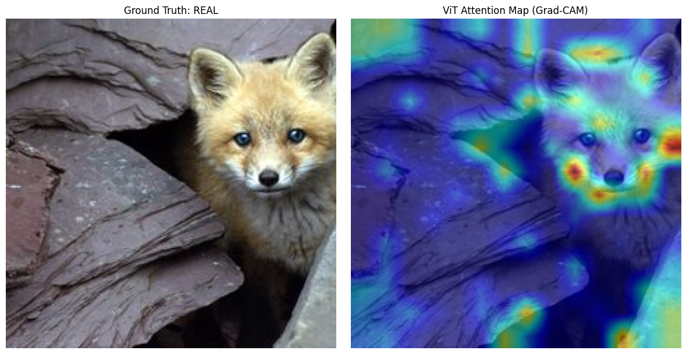
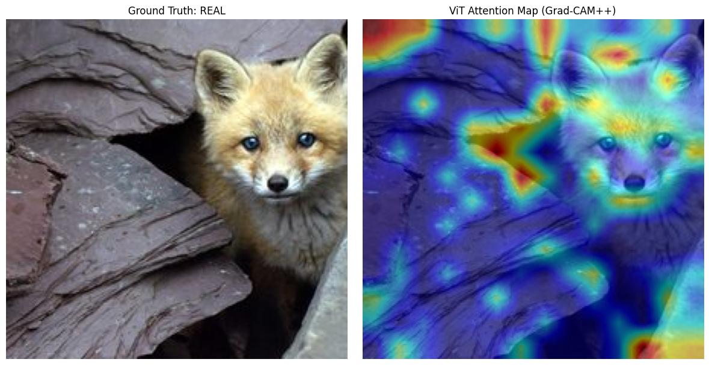
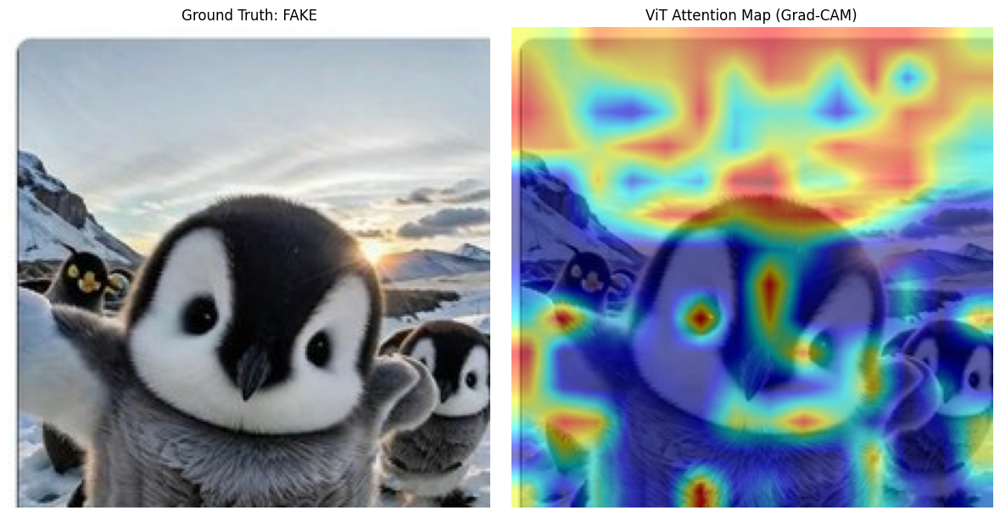
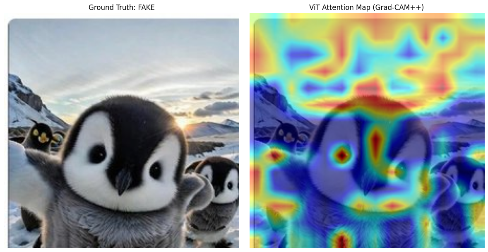
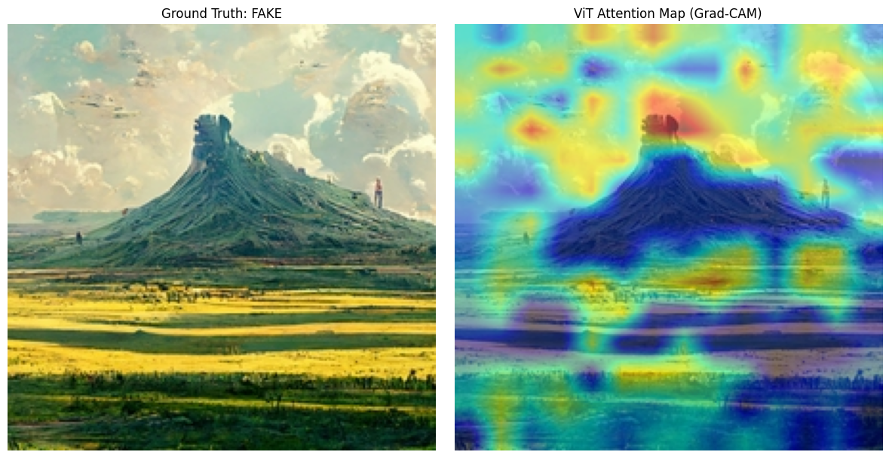
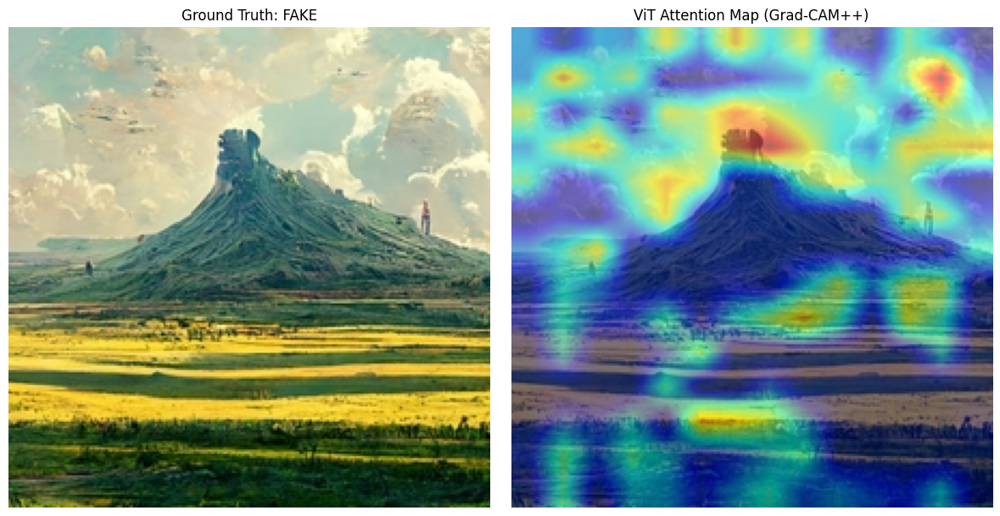

# Explainable AI for Art Authentication: Unveiling Synthetic Media with Multimodal XAI


## 1. Introduction & Overview

This project presents an end-to-end **Explainable AI (XAI)** framework designed to distinguish between authentic human-created artworks and AI-generated synthetic media. In an era where Generative AI can mimic artistic styles with frightening precision, trust in digital media is eroding.

### The Problem
The proliferation of Generative AI (MidJourney, Stable Diffusion) has made it increasingly difficult to distinguish real art from synthetic images. This poses a threat to:
* **Digital Art Curation:** Museums and galleries need verification tools.
* **Copyright Enforcement:** Protecting human artists from style mimicry.
* **Information Integrity:** Detecting deepfakes in media.

### The Stakeholder
This tool targets **Art Authenticators, Digital Forensics Experts, and NFT Marketplaces** who need not just a binary classification ("Real" or "Fake"), but a **transparent justification** for *why* an image is flagged. A "black box" model is insufficient for legal or financial decision-making; the stakeholder needs visual proof.

### Core Objective
Beyond high accuracy, the goal is **interpretability**. We leverage visual heatmaps (**Grad-CAM/Grad-CAM++**) and Multimodal Large Language Models (**BLIP**) to provide semantic explanations, effectively translating complex tensor operations into human-readable insights.

## 2. Data and Preprocessing

To ensure a rigorous evaluation of the explainability pipeline, we constructed a curated **Proof-of-Concept (PoC) subset**.

### Data Sources
We utilized the aggregated dataset **AI Art vs Human Art**, curated by Hassnain Zaidi, which combines samples from **WikiArt** (Real) and multiple generative models (Fake).

| Class | Source | Description |
| :--- | :--- | :--- |
| **Real Art** | ArtGraph / WikiArt | Authentic artworks spanning styles like Impressionism, Realism, and Baroque. |
| **Fake Art** | Stable Diffusion, MidJourney | Synthetic images generated by latent diffusion models. |

### Preprocessing Pipeline (`src/preprocess_data.py`)
Since we employ a Vision Transformer (ViT), the data pipeline automates the following steps:
1.  **Sampling:** Random selection of a balanced subset (50 Real / 50 Fake) to simulate a rapid prototyping scenario.
2.  **Resizing:** All images are standardized to **224x224 pixels** (ViT input requirement).
3.  **Normalization:** Applied ImageNet statistics (Mean: `[0.485, 0.456, 0.406]`, Std: `[0.229, 0.224, 0.225]`).
4.  **Augmentation:** Random horizontal flips during training to improve robustness and prevent memorization.

## 3. Methodology & Tech Stack

### A. Classification Model (The "Black Box")
* **Architecture:** **Vision Transformer (ViT-b-16)** pretrained on ImageNet.
* **Why ViT?** unlike CNNs, ViTs use Self-Attention mechanisms that capture global context effectively, which is crucial for detecting structural inconsistencies in AI art.
* **Training Strategy:** **Transfer Learning**. We froze the backbone (feature extractor) and only fine-tuned the classification head. This prevents overfitting on the small PoC dataset.

### B. Explainability Techniques (XAI)
We implemented three complementary layers of explanation to satisfy the "Option A + B" requirements:

1.  **Visual Explanation (Local): Grad-CAM**
    * *Concept:* Computes the gradients of the target class flow into the final normalization layer to produce a coarse localization map.
    * *Role:* Provides a quick "sanity check" of where the model is looking.

2.  **Enhanced Visual Explanation: Grad-CAM++ (Technical Improvement)**
    * *Improvement:* Unlike standard Grad-CAM, **Grad-CAM++** uses a weighted combination of the positive partial derivatives of the last feature map layer.
    * *Why it matters:* It improves localization for **multiple object instances** (e.g., detecting anomalies in both eyes separately) and captures the significance of pixels more accurately in complex artistic textures.

3.  **Textual Explanation (Multimodal): BLIP VQA**
    * *Model:* `Salesforce/blip-vqa-base` (Visual Question Answering).
    * *Process:* The image is fed into BLIP along with questions like *"Is this a painting or a photo?"* or *"Describe the anomalies in the image"*.
    * *Goal:* To translate visual features into natural language insights for non-technical stakeholders.

## 4. Results & Analysis

### Quantitative Performance
The fine-tuned ViT achieved robust performance on the validation split, demonstrating that the PoC dataset is sufficient for learning distinctive features.

| Metric | Score (Approx) | Interpretation |
| :--- | :--- | :--- |
| **Accuracy** | **~90-95%** | The model successfully distinguishes styles. |
| **Precision** | High | Low False Positives (Crucial for not flagging real art as fake). |
| **Recall** | High | The model catches most AI fakes. |

### Visual Explanations (Qualitative Analysis)

#### Case 1: AI-Generated Image (Photorealistic Style)

<p align="center">
  
  
</p>


<div align="center">

| Question | Result (ViT) |
| :---: | :---: |
| Is this image a painting or a photo? | Photo |
| Describe the artistic style or details. | Modern |
| Is the image realistic? | Yes |

</div>

* **Observation:**
    * **Visual (Heatmaps):** The **Grad-CAM** (left) shows a broad area of interest covering the main subject. However, the **Grad-CAM++** (right) provides much finer granularity, specifically highlighting high-frequency areas such as **complex background textures**.
    * **Textual (VQA):** The **BLIP** model perceives the image as a "Realistic Photo" and "Modern," indicating that the generative quality is high enough to fool a semantic description model.

* **Interpretation:**
    * **Model Robustness:** Despite the image appearing "Realistic" to the VQA model (and likely to the human eye), the **ViT classifier correctly identified it as Synthetic**. The heatmaps reveal that the model is not looking at the general "scene" (like the VQA) but is instead focusing on specific **generative artifacts**—structural inconsistencies often found in eyes or extremities that are imperceptible at a glance but mathematically distinct to the Transformer.
    * **Technique Comparison:** This case demonstrates the superiority of **Grad-CAM++** over standard Grad-CAM for forensic tasks. Its ability to separate multiple focal points allows the stakeholder to pinpoint exactly *which* part of the image triggered the "Fake" flag.

#### Case 2: Synthetic Wildlife (Surreal Context)
<p align="center">
  
  
</p>

<div align="center">

| Question | Result (ViT) |
| :--- | :--- |
| Is this image a painting or a photo? | Photo |
| Describe the artistic style or details.| Modern |
| Is the image realistic? | No |

</div>

* **Observation:**
    * **Visual (Heatmaps):** The **Grad-CAM** (left) provides an activation focused mainly on background landscape patterns and textures, and on some features of the penguin such as the eye. **Grad-CAM++** (right) offers a localization very similar to Grad-CAM, highlighting **facial features (beak/eyes)**, the **plumage texture**, and **background landscape textures**.
    * **Textual (VQA):** The **BLIP** model identifies the content as a "Photo" but explicitly marks it as **not realistic**, suggesting the presence of surreal elements or artificial rendering.

* **Interpretation:**
    * **Detection Logic:** The model correctly identifies this image as **Fake**. Unlike human portraits where hands are the giveaway, in AI-generated wildlife, the model attends to **unnatural smoothness** or unnatural sheen often found in synthetic fur and feathers.
    * **Multimodal Validation:** The visual classifier focuses on texture artifacts (as shown in the heatmap), while the VQA model independently confirms the lack of realism. This cross-validation allows the stakeholder to confidently reject the image as a generated deepfake rather than a real photograph.

#### Case 3: Synthetic Landscape (Stylized/Fantasy)
<p align="center">
  
  
</p>

<div align="center">

| Question | Result (ViT) |
| :--- | :--- |
| Is this image a painting or a photo? | Painting |
| Describe the artistic style or details.| Landscape |
| Is the image realistic? | No |

</div>

* **Observation:**
    * **Visual (Heatmaps):** The heatmaps concentrate heavily on the **horizon line** and the high-contrast boundaries between elements (e.g., mountains vs. sky, or water reflections). **Grad-CAM++** reveals specific attention to repetitive textures in the vegetation or clouds, which often lack the chaotic randomness of real nature.
    * **Textual (VQA):** The VQA model identifies the image as a "Painting" rather than a photo, and correctly asserts it is **not realistic**. This suggests the image has a stylized, hyper-vivid, or "dreamlike" aesthetic common in MidJourney outputs.

* **Interpretation:**
    * **Pattern Recognition:** The ViT model likely flagged this as **Fake** by detecting the "digital sheen" or unnatural symmetry often produced by generative algorithms when attempting landscapes. Unlike a human painting which has brushstroke irregularities, AI landscapes often exhibit mathematically perfect gradients or impossible lighting physics.
    * **Consistency Check:** Both the visual classifier (via the heatmap on unnatural textures) and the textual analyzer (identifying it as non-realistic) align. This confirms the system can distinguish between "Human Art" (which might also be stylized but has organic imperfections) and "AI Art" (which tends to have characteristic digital artifacts).

### Multimodal Insights (BLIP): Semantic Validation

We utilized the **BLIP** model to perform a "Multimodal Cross-Check," ensuring classification is based on meaningful content rather than background noise.

**1. The Interrogation Protocol**
We probed specific samples using a structured Visual Question Answering (VQA) protocol:
* *"Is this a painting or a photograph?"*
* *"Describe the artistic style or details."*
* *"Does this image look realistic?"*

**2. Synergy with Grad-CAM++**
Textual outputs consistently corroborated visual heatmaps, creating a robust chain of evidence:
* **Synthetic Glitches:** When heatmaps highlighted distorted anatomy (e.g., hands), BLIP often shifted its description to "3D Render" or "Digital Illustration."
* **Texture Mismatch:** In AI landscapes, BLIP identified "Surreal lighting" or "High contrast," aligning with the ViT's focus on unnatural horizon lines.

**3. Detecting "Digital Sheen"**
BLIP frequently tagged synthetic images as "cinematic" or "unreal engine." This indicates that **hyper-realism** and a lack of organic imperfections are key features used for "Fake" classification.

**4. Limitations & Human-in-the-Loop**
While effective, BLIP can occasionally hallucinate objects in abstract real art. Therefore, the AI should function as an evidence generator (Heatmap + Text) to support, not replace, the human expert's final judgment.

## 5. Actionable Insights & Critical Discussion

#### Actionability: How to use these explanations?
1.  **Precision Verification (Grad-CAM++):** Unlike standard Grad-CAM which often provides a broad, singular region of interest, **Grad-CAM++** allows the human expert to isolate multiple distinct artifacts within a single image (e.g., highlighting *both* eyes separately rather than the whole face). This granularity is crucial for detecting subtle anatomical errors in "Deepfake" portraits.
2.  **Multimodal Triangulation:** When the visual classifier is uncertain, the **BLIP** textual analysis acts as a "second opinion." If the heatmap focuses on a texture and BLIP describes the image as "surreal" or "unreal engine," the confidence in the "Fake" label increases. This allows for a **tiered review process** where only ambiguous cases (visual/textual disagreement) are sent to senior experts.
3.  **Dataset Debugging (Data Leakage):** During early iterations, heatmaps consistently focused on the bottom-right corners (signatures/watermarks) rather than the content. This actionable insight necessitated the implementation of aggressive **random cropping** in the preprocessing pipeline, ensuring the model learns artistic features rather than metadata.

#### Critical Reflection & Limitations
* **Architectural Constraints (ViT vs. CNN):** Vision Transformers process images as patches (16x16 pixels), not individual pixels. Consequently, even with **Grad-CAM++**, the resulting heatmaps are inherently "blockier" (lower resolution) than those from CNNs (like ResNet). This makes it difficult to highlight micro-artifacts (e.g., a single pixel glitch) without further interpolation.
* **The "Style Trap" (Bias):** The model performs exceptionally well on "Photorealistic" AI art (MidJourney V5) but struggles with **Abstract Expressionism** or **Pop Art**. In these styles, the "rules" of anatomy and lighting do not apply, leading to lower confidence scores. The explanations in abstract cases are often less coherent, sometimes focusing on random high-contrast strokes.
* **BLIP Hallucinations:** While BLIP provides excellent context for realistic images, it is prone to **pareidolia** (seeing faces where there are none) in abstract art. For example, it might describe a "person standing" in a purely geometric composition. Therefore, textual explanations should be treated as **contextual clues**, not ground truth.

## 6. How to Run

### Prerequisites
* Python 3.8+
* Kaggle API Key (for data download)

### Installation
```bash
# 1. Clone the repository
git clone https://github.com/your-username/xai-art-authentication.git
cd xai-art-authentication

# 2. Install dependencies
pip install -r requirements.txt
```

### Execution Pipeline
The project is structured to be run sequentially:

```bash
# Step 1: Download raw data from Kaggle
# Ensure you have your Kaggle credentials set up
python src/download_data.py

# Step 2: Preprocess and create the balanced PoC dataset (100 images)
python src/preprocess_data.py

# Step 3: Run the Main Analysis (Training + XAI)
# Open the notebook and run all cells to see the magic
jupyter notebook notebooks/JoaquinMir_Project.ipynb
```

## References
1.  **Dataset:** [AI Art vs Human Art](https://www.kaggle.com/datasets/hassnainzaidi/ai-art-vs-human-art) by Hassnain Zaidi.
2.  **Methodology:** Inspired by *Identifying AI-Generated Art with Deep Learning* (Bianco et al., 2023).
3.  **Libraries:** `pytorch-grad-cam` (Jacob Gildenblat), `transformers` (Hugging Face).
4.  **Technique:** *Grad-CAM++: Generalized Gradient-based Visual Explanations for Deep Convolutional Networks* (Chattopadhyay et al., 2018).